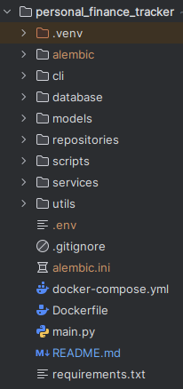
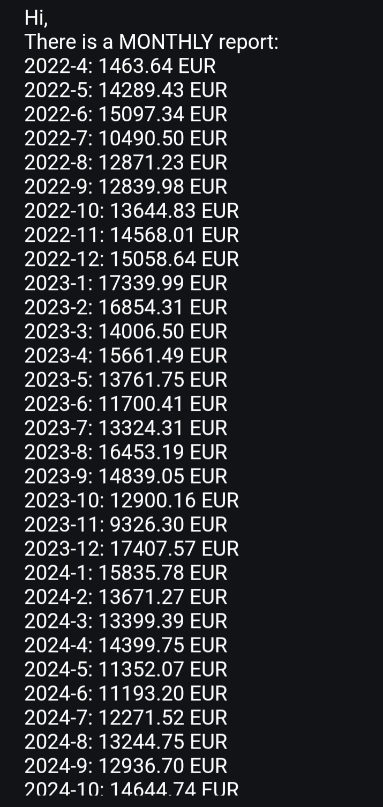
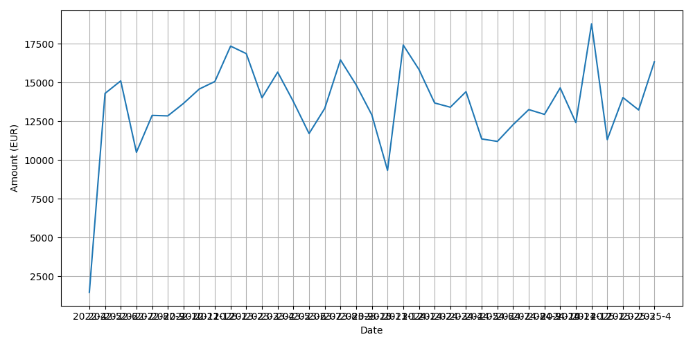
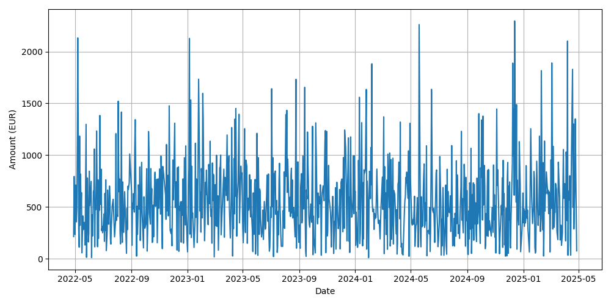

# Personal Finance Tracker

A command-line based personal finance tracker application written in Python with PostgreSQL, Docker, and several modern
tools. It supports user management, expense tracking, currency conversion, monthly summaries, email reports, and more.

---

## Features

- [x] **User authentication system** (Sign Up, Sign In, JSON session storage)
- [x] **Layered architecture** (Domain, Services, Repositories, CLI)
- [x] **PostgreSQL Database**
- [x] **Alembic** for database migrations
- [x] **Currency Conversion** using exchange rate API
- [x] **Hashed Passwords**
- [x] **Monthly & Daily summaries**
- [x] **Graphical reports with Matplotlib**
- [x] **Email monthly reports automatically**
- [x] **Environment variables with `.env`**
- [x] **Dockerized Application**
- [x] **Command-line interface with Typer**

---

## Project Structure 
`(Repository + Service Pattern)`

```
personal_finance_tracker/
├── cli/                  # Command-line logic
├── domain/               # Business models
├── services/             # Business logic
├── repositories/         # Database operations
├── config/               # Configuration & DB connection
├── migrations/           # Alembic migrations
├── .env                  # Environment variables
├── Dockerfile
├── docker-compose.yml
└── requirements.txt
```


---

## Environment Variables (.env)
```ini
SECRET_KEY=alib
DB_USERNAME=alibakhshi_user
DB_PASSWORD=alib
DB_HOST=db
DB_PORT=5432
DB_NAME=personal_finance_tracker
API_KEY=6061aa18da46726564c24452
EMAIL_PASSWORD=your_app_password
SENDER_EMAIL=aliard.bks@gmail.com
```

## How to Run

1. Clone the repository

``` bash
git clone https://github.com/AliBakhshi274/personal_finance_tracker.git
cd personal_finance_tracker
```

2. Start Docker
```dockerfile
docker-compose up --build
```

3. Run Alembic migrations

```
docker exec -it finance-app alembic revision --autogenerate -m "initial migration"
docker exec -it finance-app alembic upgrade head
```
---

## Using the CLI

### Sign up a new user
```
python -m cli.main_sign_in_out sign-up
```
### Log in
```
python -m cli.main_sign_in_out sign-in
```
### Add a new transaction
```
python -m cli.main_sign_in_out add-transaction
```

### View summary
```
python -m cli.main_sign_in_out get-monthly-summary 5
```
---

# Design Patterns & Concepts

- **Layered Architecture**: Separation of concerns between domain logic, services, and data layer
- **Typer**: For CLI interaction
- **Alembic**: For versioning and evolving database schema
- **Matplotlib**: For graphical summaries
- **Docker Compose**: For environment isolation
- **User Session JSON**: For lightweight session persistence



---

## 📈 Chart and Summaries
| Matplotlib Monthly report                      | Matplotlib Daily report             |
|------------------------------------------------|-------------------------------------|
|  |  |


